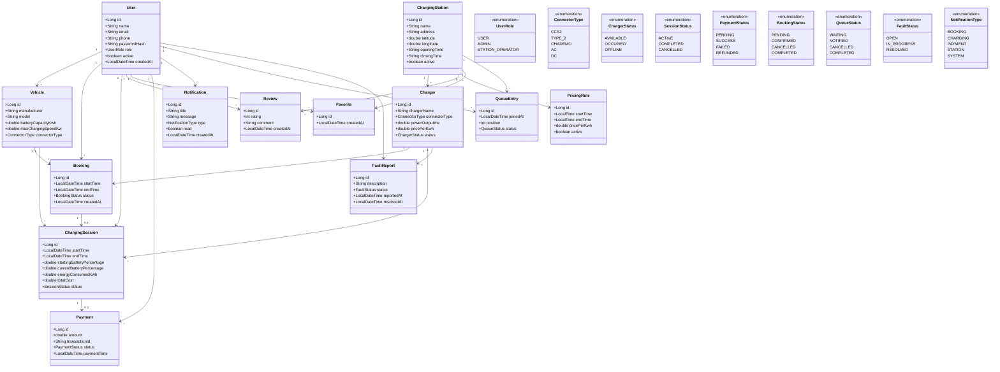

# EV Charging Backend — Class Diagram

## Domain Model

```mermaid
classDiagram

    class User {
        +Long id
        +String name
        +String email
        +String phone
        +String passwordHash
        +UserRole role
        +boolean active
        +LocalDateTime createdAt
    }

    class Vehicle {
        +Long id
        +String manufacturer
        +String model
        +double batteryCapacityKwh
        +double maxChargingSpeedKw
        +ConnectorType connectorType
    }

    class ChargingStation {
        +Long id
        +String name
        +String address
        +double latitude
        +double longitude
        +String openingTime
        +String closingTime
        +boolean active
    }

    class Charger {
        +Long id
        +String chargerName
        +ConnectorType connectorType
        +double powerOutputKw
        +double pricePerKwh
        +ChargerStatus status
    }

    class Booking {
        +Long id
        +LocalDateTime startTime
        +LocalDateTime endTime
        +BookingStatus status
        +LocalDateTime createdAt
    }

    class ChargingSession {
        +Long id
        +LocalDateTime startTime
        +LocalDateTime endTime
        +double startingBatteryPercentage
        +double currentBatteryPercentage
        +double energyConsumedKwh
        +double totalCost
        +SessionStatus status
    }

    class Payment {
        +Long id
        +double amount
        +String transactionId
        +PaymentStatus status
        +LocalDateTime paymentTime
    }

    class Review {
        +Long id
        +int rating
        +String comment
        +LocalDateTime createdAt
    }

    class Favorite {
        +Long id
        +LocalDateTime createdAt
    }

    class PricingRule {
        +Long id
        +LocalTime startTime
        +LocalTime endTime
        +double pricePerKwh
        +boolean active
    }

    class QueueEntry {
        +Long id
        +LocalDateTime joinedAt
        +int position
        +QueueStatus status
    }

    class FaultReport {
        +Long id
        +String description
        +FaultStatus status
        +LocalDateTime reportedAt
        +LocalDateTime resolvedAt
    }

    class Notification {
        +Long id
        +String title
        +String message
        +NotificationType type
        +boolean read
        +LocalDateTime createdAt
    }

    User "1" --> "*" Vehicle
    User "1" --> "*" Booking
    User "1" --> "*" ChargingSession
    User "1" --> "*" Review
    User "1" --> "*" Favorite
    User "1" --> "*" Payment
    User "1" --> "*" Notification
    User "1" --> "*" QueueEntry
    User "1" --> "*" FaultReport

    ChargingStation "1" --> "*" Charger
    ChargingStation "1" --> "*" Review
    ChargingStation "1" --> "*" PricingRule
    ChargingStation "1" --> "*" Favorite
    ChargingStation "1" --> "*" QueueEntry

    Charger "1" --> "*" Booking
    Charger "1" --> "*" ChargingSession
    Charger "1" --> "*" FaultReport

    Vehicle "1" --> "*" Booking
    Vehicle "1" --> "*" ChargingSession

    Booking "1" --> "0..1" ChargingSession
    ChargingSession "1" --> "0..1" Payment

    class UserRole {
        <<enumeration>>
        USER
        ADMIN
        STATION_OPERATOR
    }

    class ConnectorType {
        <<enumeration>>
        CCS2
        TYPE_2
        CHADEMO
        AC
        DC
    }

    class ChargerStatus {
        <<enumeration>>
        AVAILABLE
        OCCUPIED
        OFFLINE
    }

    class SessionStatus {
        <<enumeration>>
        ACTIVE
        COMPLETED
        CANCELLED
    }

    class PaymentStatus {
        <<enumeration>>
        PENDING
        SUCCESS
        FAILED
        REFUNDED
    }

    class BookingStatus {
        <<enumeration>>
        PENDING
        CONFIRMED
        CANCELLED
        COMPLETED
    }

    class QueueStatus {
        <<enumeration>>
        WAITING
        NOTIFIED
        CANCELLED
        COMPLETED
    }

    class FaultStatus {
        <<enumeration>>
        OPEN
        IN_PROGRESS
        RESOLVED
    }

    class NotificationType {
        <<enumeration>>
        BOOKING
        CHARGING
        PAYMENT
        STATION
        SYSTEM
    }
```
